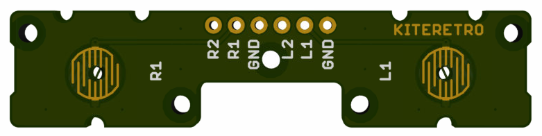

# CS_ORIGINAL_BACKBUTTONS_V1.0b
This is a back button board from the Circuit Sword (and Lite)

# How to Order
## OSHPark
You can order directly from this link: https://oshpark.com/shared_projects/vr5AJ943

_NOTE: The original board is 1.00mm thick, OSHPark defaults to 1.6mm_

## Any Other Fab
You can upload the .zip file in this directory to any PCB fab

_NOTE: Please order in 1.00mm thickness_

# License
* These files are provided AS IS and should be used for a customer to upload to a PCB fabricator (OSHPark, DirtyPCBs, ALLPCB, etc) and SHOULD NOT be sold commercially
* These files are not to be sold
* These files can be modified but credit must always be given (linked to this GitHub repo)
