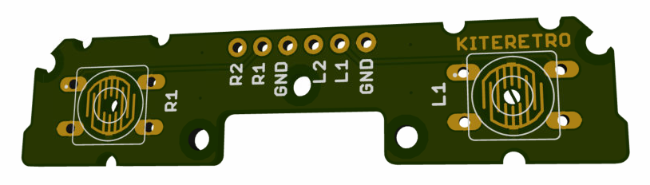

# CS_ORIGINAL_BACKBUTTONS_V1.0c
This is a back button board from the Circuit Sword (and Lite)

# License
* These files are provided AS IS and should be used for a customer to upload to a PCB fabricator (OSHPark, DirtyPCBs, ALLPCB, etc) and SHOULD NOT be sold commercially
* These files are not to be sold
* These files can be modified but credit must always be given (linked to this GitHub repo)

